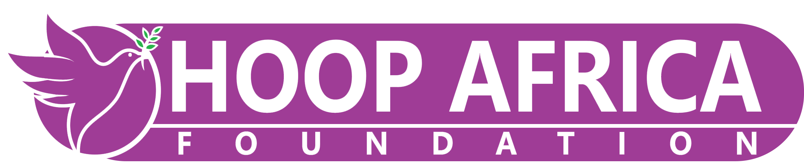

**HOOP AFRICA FOUNDATION**
*Research · Innovation · Development*

🌐 [www.hoopafrica.org](https://www.hoopafrica.org) · ✉️ info@hoopafrica.org · 📞 +264 81 302 2416

---

🇳🇦 **PEPAS — Public Enterprises Performance & Accountability System**

---

**TO:** The Chief Executive Officer, NamWater

**FROM:** Fanuel Dangarembizi | Director, Hoop Africa Foundation
✉️ info@hoopafrica.org | fanuel2020@yahoo.com | 📞 +264 81 302 2416

**DATE:** March 2026

**RE:** PEPAS — Performance Monitoring for NamWater in the New Centralised Oversight Framework

---

### Dear CEO,

NamWater delivers an essential public service — bulk water supply to a country where water security is a strategic priority. As the Government of Namibia centralises SOE oversight under the Office of the Prime Minister, entities delivering critical infrastructure services will face heightened performance scrutiny.

Hoop Africa Foundation conducted **two years of primary research** into how Namibian commercial SOEs manage strategy, implementation, and evaluation. Our findings revealed a national-level gap in monitoring and evaluation — confirmed by the **JSA/JICA-sponsored M&E workshop** that identified this as a sector-wide deficiency.

We built **PEPAS** to provide every SOE with the digital infrastructure to report, measure, and demonstrate performance in a standardised, comparable way.

### What PEPAS Delivers for NamWater

| Feature | Value to NamWater |
|---------|------------------|
| **Performance Dashboard** | NamWater's KPIs, score trends, and quarterly performance in a single entity view |
| **Fiscal Health Monitoring** | Track liquidity, arrears, operating margins, and revenue collection in real-time |
| **Quarterly Reporting Portal** | Structured submissions replacing ad-hoc reporting — evidence uploads and corrective actions included |
| **Compliance Tracking** | Annual report deadlines and audit outcomes monitored against statutory requirements |
| **Portfolio Benchmarking** | See NamWater's performance relative to peer SOEs in the water and sanitation sector |

### Your Entity, Your Data

PEPAS includes dedicated entity-level drill-down for NamWater — performance gauges, risk classification, and trend data benchmarked against the national portfolio. The demo uses simulated data for 12 major SOEs. With your participation, we integrate real operational data.

### Live Demo

**See NamWater in the national portfolio:** [https://namibia-pepas.vercel.app](https://namibia-pepas.vercel.app)

We welcome the opportunity to present a demonstration to your executive team.

---

*Hoop Africa Foundation — Supporting Namibia's Development*
🌐 [www.hoopafrica.org](https://www.hoopafrica.org) · ✉️ info@hoopafrica.org · 📞 +264 81 302 2416

